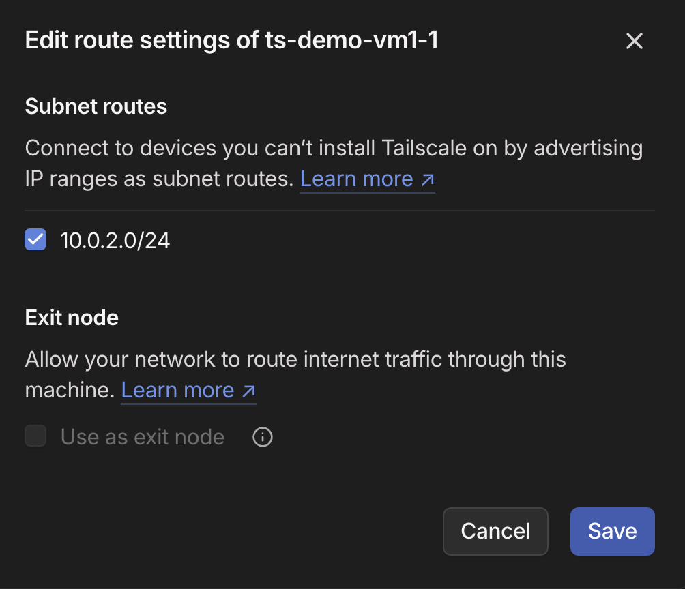

# Demo - Django Developer with Zero-Config VPN Access to AWS

## Project Objective
### Demonstrating Modern Developer Workflows

This project showcases two powerful tools that streamline cloud development and access:

1. **Infrastructure as Code with Terraform**
   - Rapidly deploy AWS infrastructure
   - Automate creation of VPCs, subnets, and security groups
   - Provision and configure multiple EC2 instances

2. **Automated Setup of Secure Remote Access with Tailscale**
   - Zero-configuration VPN (Tailnet) for secure remote access
   - Subnet routing to connect VPC resources to your Tailnet
   - Keyless SSH access to instances

The combination demonstrates how developers can quickly deploy cloud infrastructure and securely access it without complex VPN setups or SSH key management.

## Project Architecture


## Project Components

- Tailnet
- VPC with public subnet (10.0.1.0/24) and private subnet (10.0.2.0/24)
- EC2 instances
  - vm1 in public subnet with Tailscale client and configured as a subnet router
  - django vm in public subnet with Tailscale client
  - vm2 in private subnet, no Tailscale client, reachable via vm1 subnet router

### AWS VPC Security

- The VPC demonstrates common security constraints developers encounter in enterprise AWS environments:
  - Private subnets with no direct internet access
  - Restricted or no inbound traffic allowed to application servers
  - Need to access development/test environments through bastion hosts or VPNs

- The private subnet 10.0.2.0/24 has no direct internet connectivity (no NAT gateway) and can only communicate externally through the subnet router (vm1)

- The public subnet 10.0.1.0/24 has no inbound traffic allowed and unrestricted outbound traffic through the Internet Gateway, so it can reach the Tailscale network

### Django Application

- A Django application is included in this demo to demonstrate a real-world use case where a developer could easily setup remote access to write code and test applications running in a typical VPC setup without the usual hassles.

- Terraform is showcased as a way to automate the entire deployment and startup of the demo Django application located at: https://github.com/esoteric-git/django-app.git by cloning it into the EC2 instance and running the commands to install dependencies, seed the database, and run the application.

- The Django application is configured to run on port 8000 and will be accessible through the tailnet name (http://ts-demo-django:8000)

## Prerequisites

### Required Software On Your Local Machine

- Terraform installed 
- Tailscale client installed and connected to your Tailnet
- Git for cloning this repository

### Required Accounts

- AWS Account with permissions to create:
  - VPC and associated networking resources
  - EC2 instances
  - Security Groups

- Tailscale Account

## Setup Project And Deploy Infrastructure

1. **Clone the Repository**
   ```bash
   git clone https://github.com/esoteric-git/ts-demo-1.git
   cd ts-demo-1
   ```

2. **Create Environment File**
   
   Copy the `.env.example` file to `.env` and populate with your credentials:
   ```bash
   AWS_ACCESS_KEY_ID="your-aws-access-key"
   AWS_SECRET_ACCESS_KEY="your-aws-secret-key"
   TF_VAR_tailscale_auth_key="tskey-auth-xxxxx"
   ```

3. **Load Environment Variables**
   ```bash
   source .env
   ```

4. **Deploy Infrastructure**
   ```bash
   terraform init
   terraform apply
   ```

## Developer Workflow

### Confirming Terraform Deployment

- Note the outputs from the terraform deployment in the terminal:
  - vm1_public_ip
  - vm2_private_ip
  - django_vm_public_ip

- Confirm the VPC, Subnet, and EC2 instances were created in the AWS Console

- In Tailscale > Machines
  - Confirm vm1 and the django vm are connected
  - Click on vm1 and confirm the subnet router is enabled
  - If subnet not enabled, click "review" and click the checkbox and save

    

### Testing Remote Access From Local Machine

- After confirming the deployment, you can ping vm-2's private IP (instance in the private subnet) despite vm-2 having no direct internet connectivity. The ping is routed through vm-1 which is acting as a Tailscale subnet router.

- You can SSH into vm-1 and the django instance with no need for traditional SSH keys or open ports because Tailscale SSH is enabled on the instances.

- You can browse directly to the Django app using its tailnet name (http://ts-demo-django:8000) despite the VPC security groups having no inbound rules, because its on the same tailnet.

- If you disconnect your local Tailscale client, you will not be able to access any of the AWS instances, thus demonstrating the reliance on the remote access functionality.
